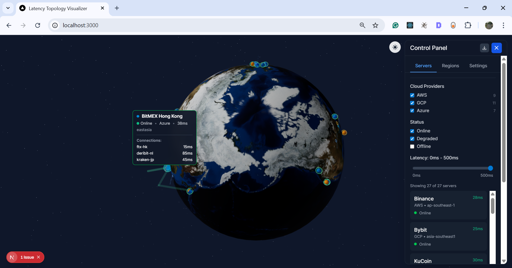

# Latency Topology Visualizer

A modern, interactive 3D visualization tool for monitoring and analyzing latency across global server infrastructure. Built with Next.js, React Three Fiber, and TypeScript.



## Features

- 🌍 Interactive 3D globe with server locations
- 📊 Real-time and historical latency visualization
- 🔄 Animated connections between servers
- 🎨 Color-coded server status indicators
- 🔍 Filter by provider, status, and latency range
- 📈 Historical latency trends with time range selection
- 🌓 Light/dark theme support
- 📤 Export data as JSON, CSV, or PNG

## Tech Stack

- **Framework**: [Next.js](https://nextjs.org/)
- **3D Rendering**: [React Three Fiber](https://docs.pmnd.rs/react-three-fiber/getting-started/introduction)
- **UI Components**: [Tailwind CSS](https://tailwindcss.com/)
- **Charts**: [Recharts](https://recharts.org/)
- **State Management**: React Context API
- **Type Safety**: TypeScript

## Getting Started

### Prerequisites

- Node.js 18.0.0 or later
- npm, yarn, or pnpm

### Installation

1. Clone the repository:
   ```bash
   git clone https://github.com/your-username/latency-topology-visualiser.git
   cd latency-topology-visualiser
   ```

2. Install dependencies:
   ```bash
   npm install
   # or
   yarn
   # or
   pnpm install
   ```

3. Run the development server:
   ```bash
   npm run dev
   # or
   yarn dev
   # or
   pnpm dev
   ```

4. Open [http://localhost:3000](http://localhost:3000) in your browser.

## Usage

### Viewing Server Information
- Click on any server marker to view detailed information
- Hover over connections to see latency between servers
- Use the control panel to filter and customize the view

### Control Panel
- **Servers Tab**: View and filter server list
- **Regions Tab**: Toggle cloud provider regions
- **Settings Tab**: Configure display options
  - Toggle connections, heatmap, and topology view
  - Adjust theme (light/dark)

### Exporting Data
Click the "Export" button to download:
- **JSON**: Complete server data
- **CSV**: Tabular data for analysis
- **PNG**: Screenshot of the current view

## Project Structure

```
src/
├── app/                  # Next.js app router
├── components/           # Reusable components
│   ├── charts/           # Data visualization components
│   ├── controls/         # Control panel and UI elements
│   ├── globe/            # 3D globe and markers
│   └── topology/         # Topology visualization
├── data/                 # Mock data and types
└── lib/                  # Utility functions
```

## Customization

### Adding New Servers
Edit the server data in `src/data/exchanges.ts` to add or modify server information.

### Styling
- Global styles are in `app/globals.css`
- Component-specific styles use Tailwind CSS
- Theme colors are defined in `tailwind.config.js`

## Performance Considerations

- Server-side rendering is disabled for 3D components to improve performance
- Data is filtered and memoized to prevent unnecessary re-renders
- Large datasets should be paginated or virtualized

## Contributing

Contributions are welcome! Please open an issue or submit a pull request.

## License

This project is licensed under the MIT License - see the [LICENSE](LICENSE) file for details.
