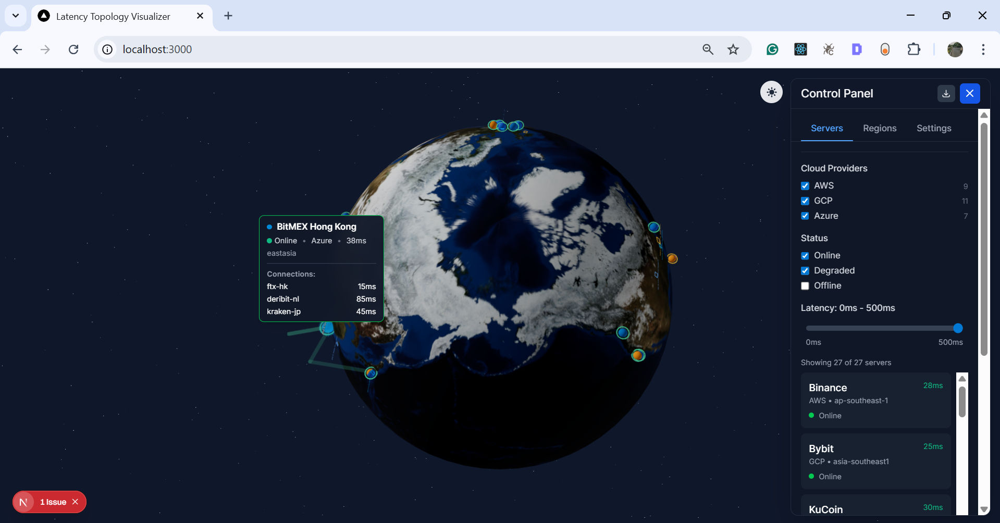

# Cryptocurrency Exchange Latency Visualizer

A comprehensive 3D visualization platform for monitoring and analyzing latency across global cryptocurrency exchange infrastructure. This application provides real-time and historical insights into network performance between major exchanges and cloud provider regions.



## ✨ Features

### 🌐 3D World Map
- Interactive 3D globe with smooth camera controls (rotate, zoom, pan)
- Real-time rendering of exchange server locations
- Responsive design supporting both desktop and mobile devices

### 🔍 Exchange Server Visualization
- 3D markers for major cryptocurrency exchanges (Binance, Coinbase, Kraken, etc.)
- Color-coded markers by cloud provider (AWS, GCP, Azure)
- Detailed tooltips with server information on hover/click
- Search and filter functionality for quick navigation

### ⚡ Real-time Latency Monitoring
- Animated connections showing latency between nodes
- Color-coded latency indicators (green/yellow/red)
- Pulsing effects for active connections
- Configurable update intervals

### ☁️ Cloud Provider Regions
- Visual representation of AWS, GCP, and Azure regions
- Region boundaries and server clusters
- Toggle visibility of different cloud providers
- Region-specific performance metrics

### 📊 Historical Data Analysis
- Time-series charts for latency trends
- Configurable time ranges (1h, 24h, 7d, 30d)
- Statistical analysis (min, max, avg latency)
- Exportable reports in multiple formats

### 🎛️ Interactive Controls
- Intuitive control panel with multiple tabs
- Server and region filtering
- Theme toggling (light/dark mode)
- Performance optimization settings

## 🛠️ Tech Stack

- **Framework**: [Next.js](https://nextjs.org/) (App Router)
- **3D Rendering**: [React Three Fiber](https://docs.pmnd.rs/react-three-fiber) + [Drei](https://github.com/pmndrs/drei)
- **State Management**: React Context API + useState (Internal)
- **Data Visualization**: [Recharts](https://recharts.org/)
- **Type Safety**: TypeScript
- **Package Manager**: pnpm

## 🚀 Getting Started

### Prerequisites

- Node.js 18.0.0 or later
- pnpm (recommended) or npm/yarn

### Installation

1. Clone the repository.

2. Install dependencies:
   ```bash
   pnpm install
   ```

3. Start the development server:
   ```bash
   pnpm dev
   ```

4. Open [http://localhost:3000](http://localhost:3000) in your browser.

## 🎮 Usage Guide

### Navigation
- **Rotate**: Click and drag the globe
- **Zoom**: Scroll or pinch (on touch devices)
- **Pan**: Right-click and drag or two-finger drag (on touch devices)
- **Reset View**: Click the home button in the control panel

### Control Panel
- **Servers Tab**: View and filter exchange servers
- **Regions Tab**: Toggle cloud provider regions
- **Settings Tab**: Configure visualization preferences
  - Toggle connection animations
  - Adjust performance settings
  - Change theme (light/dark)

### Data Interaction
- **Click** on any marker for detailed information
- **Hover** over connections to see latency metrics
- Adjust the **time range** to view historical data

## 🏗️ Project Structure

```
src/
├── app/                    # Next.js app router
│   └── (main)/             # Main application routes
│       └── page.tsx        # Home page component
│
├── components/
│   ├── charts/            # Data visualization components
│   ├── controls/          # Control panel and UI elements
│   │   ├── control-panel.tsx
│   │   └── tabs/          # Tabbed interface components
│   │
│   ├── globe/             # 3D visualization components
│   │   ├── connections.tsx  # Animated latency connections
│   │   ├── server-markers.tsx  # Exchange server markers
│   │   └── region-markers.tsx  # Cloud region markers
│   
│
├── data/                  # Data models and mock data
│   ├── exchanges.ts       # Exchange server data
│   └── regions.ts         # Cloud region definitions
│
├── lib/                   # Utility functions
│   ├── utils.ts           # Helper functions
│   └── three-utils.ts     # Three.js utilities
│
└── styles/                # Global styles
    └── globals.css        # Global CSS variables and styles
```

## 🧩 Customization

### Adding New Exchanges
Edit `src/data/exchanges.ts` to add or modify exchange server information. Each server should include:
- Unique ID
- Display name and code
- Geographic coordinates (lat/lon)
- Cloud provider and region
- Connection details

### Styling
- Colors and theming can be customized in `tailwind.config.js`
- 3D object materials and lighting can be adjusted in the respective component files

## 📝 Assumptions

1. **Data Source**: The application currently uses mock data. In a production environment, you would connect to a real-time API for latency data.
2. **Performance**: The 3D visualization is optimized for modern browsers with WebGL support.
3. **Mobile Support**: Basic touch controls are implemented, but the best experience is on desktop.
4. **Security**: No sensitive data is stored or transmitted in the current implementation.

## 🚀 Deployment

### Building for Production
```bash
pnpm build
```

### Starting Production Server
```bash
pnpm start
```

### Static Export (Optional)
```bash
pnpm export
```
